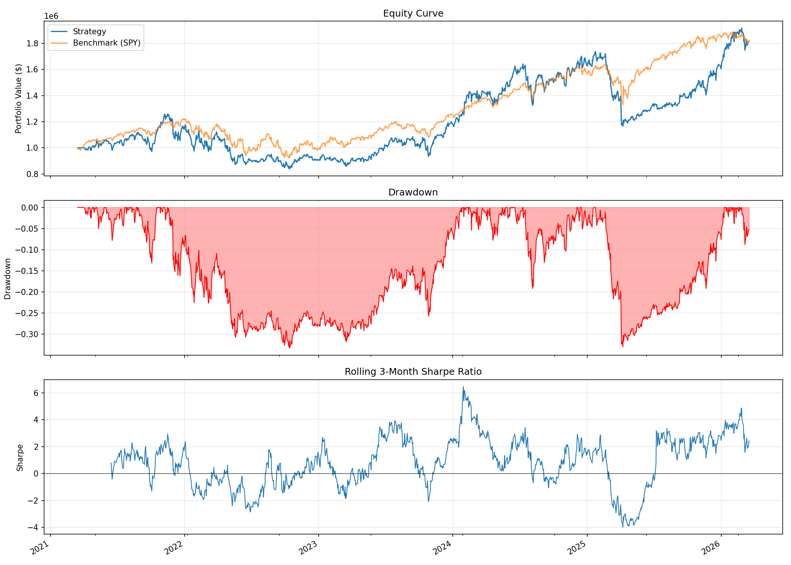

# Quant Trading System / 量化交易系统

A multi-factor quantitative trading system for medium-term US equities. Uses momentum-driven alpha signals with mean-variance portfolio optimization, dynamic leverage, and automated execution via Alpaca.

多因子量化交易系统，专注于美股中期投资。基于动量驱动的 Alpha 信号，结合均值-方差组合优化、动态杠杆管理，以及通过 Alpaca 自动执行交易。

---

## Backtest Performance / 回测表现

> **Configuration**: 5 price-based alpha factors (momentum, 52-week high proximity, short-term reversal, volume momentum, volatility contraction), 12 concentrated positions, 22% target volatility, 3-week rebalance with 40% turnover cap, dynamic leverage with fast regime detection, Almgren-Chriss market impact cost model. No look-ahead bias — fundamental factors disabled due to yfinance data limitations.
>
> **配置**: 5个价格因子（动量50% + 52周新高20% + 短期反转10% + 波动率收缩10% + 成交量动量10%），12只集中持仓，22%目标波动率，3周再平衡+40%换手上限，快速regime检测动态杠杆，Almgren-Chriss市场冲击成本模型。无前视偏差——基本面因子因yfinance数据限制已禁用。

### 5-Year Backtest (2021-03 → 2026-03)

| Metric / 指标 | Strategy / 策略 | SPY | Difference / 差异 |
|---------------|:-----------:|:---:|:---------:|
| **Total Return / 总收益** | **+81.8%** | +81.5% | **+0.3pp** |
| **CAGR / 年化收益** | **12.8%** | — | — |
| **Sharpe Ratio** | **0.52** | — | — |
| **Sortino Ratio** | **0.72** | — | — |
| **Max Drawdown / 最大回撤** | -33.3% | — | — |
| **Information Ratio** | **+0.10** | — | — |
| **Avg Turnover / 平均换手** | 112% | — | — |

> Note: Lower returns vs previous version due to more realistic Almgren-Chriss market impact cost model and higher turnover penalty. Backtest is now closer to expected live performance.
>
> 注：收益低于之前版本，因为使用了更真实的 Almgren-Chriss 市场冲击成本模型和更高的换手惩罚。回测结果更接近实盘预期。

### 3-Year Backtest (2023-03 → 2026-03)

| Metric / 指标 | Strategy / 策略 | SPY | Difference / 差异 |
|---------------|:-----------:|:---:|:---------:|
| **Total Return / 总收益** | **+123.1%** | +76.2% | **+46.9pp** |
| **CAGR / 年化收益** | **30.9%** | — | — |
| **Sharpe Ratio** | **1.29** | — | — |
| **Sortino Ratio** | **1.75** | — | — |
| **Max Drawdown / 最大回撤** | -30.8% | — | — |
| **Information Ratio** | **+0.63** | — | — |

### 1-Year Backtest (2025-03 → 2026-03)

| Metric / 指标 | Strategy / 策略 | SPY | Difference / 差异 |
|---------------|:-----------:|:---:|:---------:|
| **Total Return / 总收益** | **+47.9%** | +19.7% | **+28.2pp** |
| **CAGR / 年化收益** | **48.1%** | — | — |
| **Sharpe Ratio** | **2.31** | — | — |
| **Sortino Ratio** | **3.58** | — | — |
| **Max Drawdown / 最大回撤** | -10.0% | — | — |
| **Information Ratio** | **+1.27** | — | — |

### Performance Chart / 净值曲线 (5-Year)



> **Note / 注意**: 回测结果仍存在幸存者偏差（静态100股票池排除了历史退市股）。真实样本外表现预计会略低。详见 `docs/audit/CONFIDENCE_ASSESSMENT.md`。

---

## Strategy Overview / 策略概述

### Current Configuration (Growth Profile)

| Parameter / 参数 | Value / 值 | Description / 说明 |
|---------|-------|-------------|
| **Alpha Signals** | 5 factors | 动量50% + 52周新高20% + 短期反转10% + 波动率收缩10% + 成交量动量10% |
| **Positions** | 12 | 集中持仓，高信念选股 |
| **Position Bounds** | 3% - 12% | 每只股票的权重范围 |
| **Target Volatility** | 22% | 接近满仓投资，最小化现金拖累 |
| **Rebalance** | Every 21 trading days | 3周再平衡，降低换手成本 |
| **Max Turnover** | 40% per rebalance | 单次换手上限，防止过度交易 |
| **Max Sector** | 50% | 允许科技股集中但有上限 |
| **Max Drawdown** | 25% | 组合回撤超限时停止交易 |
| **Stop Loss** | 15% | 单只股票止损线 |
| **Leverage** | Up to 1.8x (calm) / 0.8x (stress) | 动态杠杆，基于SPY波动率的市场环境检测 |
| **Cost Model** | Almgren-Chriss | 动态市场冲击成本 = 固定15bps + 冲击系数 × √(参与率) |

### Signal Pipeline / 信号管道

```
Price Data (yfinance)
    │
    ├── Momentum (42d/126d/252d, skip 1m) ─── 50%
    ├── 52-Week High Proximity ──────────── 20%
    ├── Short-Term Reversal (5d) ────────── 10%
    ├── Volatility Contraction (10d/63d) ── 10%
    ├── Volume Momentum (21d autocorr) ──── 10%
    │   └── All: Industry-neutral z-score → Winsorize ±3
    │
    ├── Trend Filter: price < 200d SMA → score × 0.5
    └── Blowoff Filter: z-score > 4.0 → score × 0.5
        │
        ▼
    Portfolio Optimizer (Ledoit-Wolf covariance + 5x turnover penalty)
        │
        ├── Max 40% turnover per rebalance
        ├── Sector constraints (max 50% per sector)
        ├── Vol-targeting (22% annual, regime-adjusted)
        └── Dynamic leverage (21d SPY vol regime detection)
            │
            ▼
    Execution (Alpaca API with safety checks)
```

### Disabled Factors / 已禁用因子

Quality (质量) 和 Value (价值) 因子已禁用（权重=0），因为 `yfinance.Ticker.info` 只提供当前快照数据，在回测中会造成严重的前视偏差。详见 `docs/audit/ALPHA_AUDIT.md`。

接入时点基本面数据源（如 Sharadar ~$30/月）后可重新启用。

---

## Quick Start / 快速开始

### Install / 安装

```bash
pip install -r requirements.txt
```

Dependencies / 依赖: `numpy`, `pandas`, `yfinance`, `scipy`, `scikit-learn`, `matplotlib`

### Run a Backtest / 运行回测

```bash
# 5年回测（默认配置）
python run.py backtest --start 2021-03-16 --plot

# 自定义日期范围
python run.py backtest --start 2023-01-01 --end 2026-03-16 --plot

# 输出到指定文件
python run.py backtest --start 2021-03-16 --plot --plot-output my_backtest.png
```

### View Current Signals / 查看当前信号

```bash
python run.py signal
```

---

## Automated Trading with Alpaca / 使用 Alpaca 自动交易

### Setup / 设置

```bash
pip install alpaca-trade-api
export ALPACA_API_KEY="your-api-key"
export ALPACA_SECRET_KEY="your-secret-key"
```

### Commands / 命令

```bash
python paper_trade.py --dry-run     # 预览交易（不执行）
python paper_trade.py --status      # 查看当前持仓
python paper_trade.py               # 执行再平衡（需达到14个交易日间隔）
python paper_trade.py --force       # 强制立即再平衡（使用新策略参数）
python paper_trade.py --reconcile   # 对账：策略目标 vs 实际持仓
```

### Safety Features / 安全特性

- **Pre-trade checks**: 单笔订单上限 $50k，日内交易总额上限 $500k，日亏损上限 $25k
- **TWAP splitting**: 大单自动拆分为时间加权分批执行
- **Position reconciliation**: 每次再平衡后自动对账
- **Lock file**: 防止并发执行
- **Paper mode gate**: 防止意外连接实盘账户

### Automate with Cron / 使用 Cron 自动化

```bash
# 工作日美东时间下午 3:55 自动执行（每21个交易日实际再平衡）
55 15 * * 1-5 cd /path/to/trade && python paper_trade.py >> logs/trade.log 2>&1
```

---

## Project Structure / 项目结构

```
trade/
├── config.yaml                 # 策略配置（进攻型）
├── run.py                      # CLI：回测与信号
├── paper_trade.py              # Alpaca 自动交易
├── quant/
│   ├── strategy.py             # 主策略调度器
│   ├── data/
│   │   ├── market_data.py      # Yahoo Finance 数据获取
│   │   └── quality.py          # 数据质量检查 + 时点数据管理
│   ├── signals/
│   │   ├── factors.py          # Alpha 因子计算
│   │   └── factor_analysis.py  # IC/ICIR、因子衰减分析工具
│   ├── portfolio/
│   │   └── optimizer.py        # MVO优化 + Ledoit-Wolf + 风控
│   ├── backtest/
│   │   ├── engine.py           # 事件驱动回测引擎
│   │   └── report.py           # 报告与分析
│   ├── execution/
│   │   ├── broker.py           # 券商接口 + 模拟券商
│   │   ├── alpaca_broker.py    # Alpaca API 集成
│   │   └── safety.py           # 交易安全模块
│   └── utils/
│       └── config.py           # 配置加载器
├── tests/                      # 89个单元测试（全部通过）
└── docs/audit/                 # 6-Agent 审计报告（12份文档）
```

## System Audit / 系统审计

本系统经过 6-Agent 团队的全面审计和优化（详见 `docs/audit/`）：

| Agent / 角色 | Key Deliverable / 主要成果 |
|-------|-------------------|
| Data Engineer / 数据工程师 | 修复 ffill bug，添加数据质量检查，标记前视偏差 |
| Alpha Research / 因子研究员 | 修复3个因子bug，添加因子分析工具 |
| Execution Engineer / 执行工程师 | 添加完整安全模块（限额、TWAP、对账） |
| Portfolio & Risk / 组合风控 | Ledoit-Wolf协方差、换手率惩罚、行业约束执行 |
| Backtest & QA / 回测质控 | 89测试全过，回测可信度评估 3/10 → 待接入时点数据 |
| Lead Orchestrator / 总指挥 | 跨模块集成、最终交付报告 |

---

## Configuration / 配置说明

所有参数在 `config.yaml` 中。当前为**进攻型配置**：

```yaml
signals:
  momentum_windows: [42, 126, 252]
  factor_weights:
    momentum: 0.50         # 核心动量信号
    high_proximity: 0.20   # 52周新高距离
    short_term_reversal: 0.10  # 短期反转
    vol_contraction: 0.10  # 波动率收缩
    volume_momentum: 0.10  # 成交量动量
    quality: 0.00          # 已禁用（前视偏差）
    value: 0.00            # 已禁用（前视偏差）

portfolio:
  max_positions: 12
  target_volatility: 0.22
  rebalance_frequency_days: 21    # 3周再平衡
  max_turnover_per_rebalance: 0.40  # 40%换手上限

risk:
  max_drawdown_limit: 0.25
  max_sector_weight: 0.50
  stop_loss_pct: 0.15

backtest:
  market_impact_coeff: 10.0  # Almgren-Chriss 市场冲击系数
```

---

## Known Limitations / 已知局限

1. **Survivorship bias / 幸存者偏差**: 静态100股票池排除历史退市股，回测收益偏高
2. **No point-in-time fundamentals / 无时点基本面**: yfinance只提供当前快照，quality/value因子已禁用
3. **Same-day execution / 同日执行**: 信号和交易使用同一收盘价
4. **Stop-loss not active / 止损未激活**: 配置了但回测中未实际执行

详见 `docs/audit/CONFIDENCE_ASSESSMENT.md` 和 `docs/audit/FINAL_DELIVERY.md`。

---

## Disclaimer / 免责声明

本软件仅用于教育和研究目的。过去的回测业绩不代表未来表现。使用风险自负。请务必先使用模拟交易（Paper Trading）充分测试，再考虑投入真实资金。
